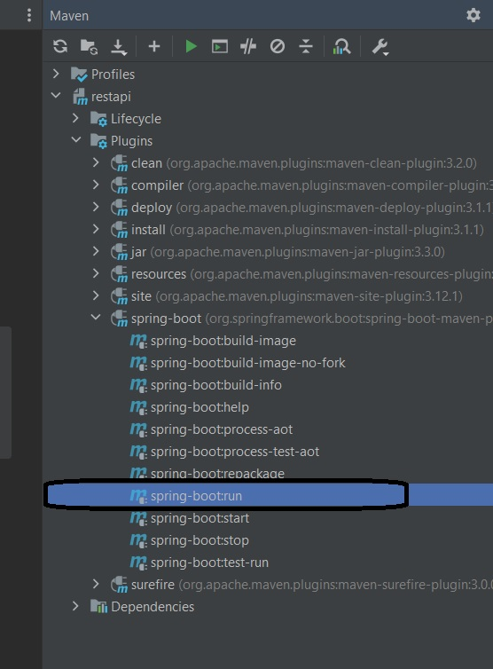
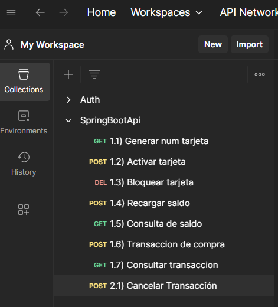

## Como ejecutar de manera local ?

1. Clonar este repo
2. Instala las dependencias (pom.xml) haciendo uso de maven
3. Crea un archivo .env con las variables necesarias,
 este sirve tanto para la aplicación como para el uso del archivo docker-compose.
<br> 
4. Acá un ejemplo:
  ```
   DBPASSWORD=123456
   DBUSERNAME=root
   DBHOST=127.0.0.1
   DBPORT=3306
   DBNAME=carddb
   ```

4. Ejecuta docker compose up en el directorio raiz de esta manera se creará/ejecutará 
un contenedor con un servicio con la base de datos. (MySQL)
5. Usa Maven para ejecutar el comando spring-boot:run. por ejemplo con Intellij Idea:
   
6. Una vez esté corriendo, puedes hacer las peticiones, dentro del proyecto hay una colección de 
Postman con cada uno.

7. Los detalles de la implementación se encuentran en una archivo PDF en el directorio raiz.